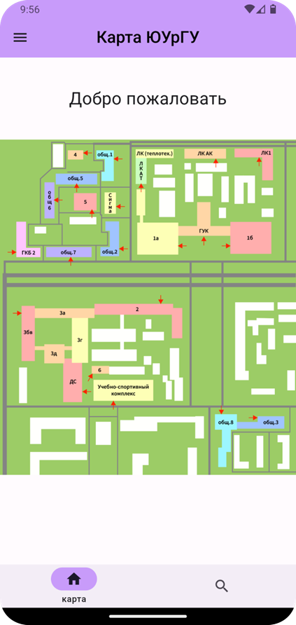
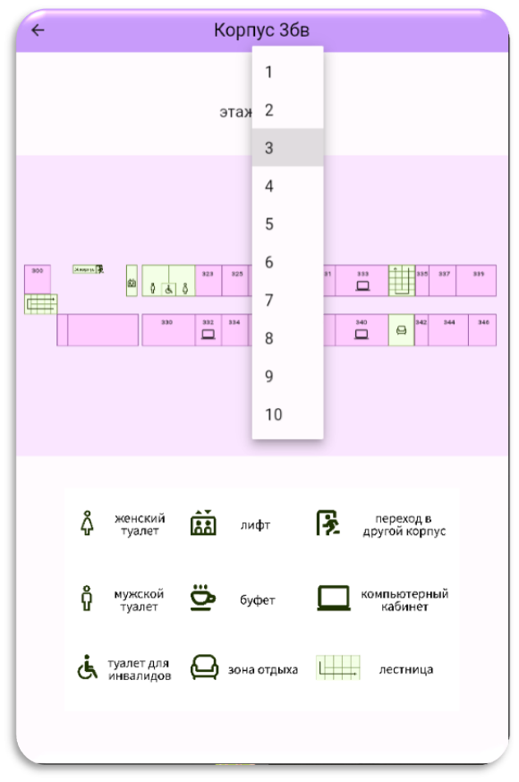
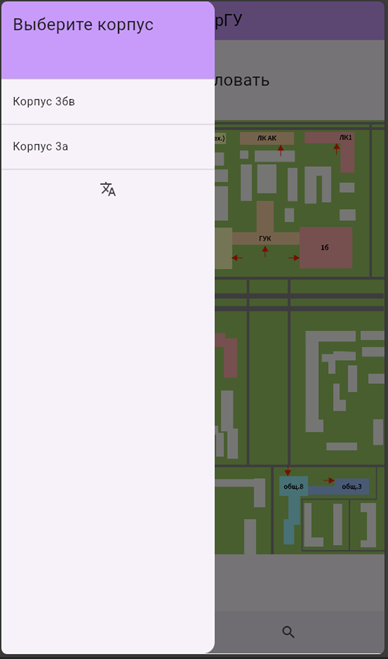
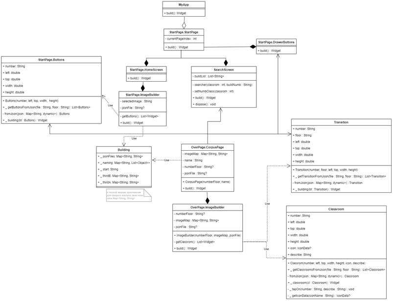

# mvp мобильного приложения "Карта ЮУрГУ"
Автор кода: [@annyeiya](https://github.com/annyeiya)
Автор изображений: [@LisettKa](https://github.com/LisettKa)
## Описание
Учебный проект создания mvp мобильного приложения "Карта ЮУрГУ". Приложение предоставляет возможность просмотра планов этажей каждого из корпусов учебного заведения, а также наглядно демонстрирует переходы между корпусами и предоставляет дополнительную информацию об аудитории при клике на нее.
<table>
  <tr>
    <td></td>
    <td></td>
    <td></td>
  </tr>
</table>

Система реализована как мобильное приложение. Все данные (подложки планов и данные аудиторий и переходов) хранятся внутри приложения.   Реализованный функционал: 
* Просмотр общего плана расположения корпусов и планов каждого этажа корпуса 
* Выбор нужного корпуса из списка в боковом меню и кликом по нему на общем плане
* Выбор нужного этажа внутри корпуса
* При клике на аудиторию показывается информация об это аудитории
* При клике на переход происходит переключение на карту того корпуса, куда ведет этот переход
* Поиск аудитории путем ввода ее номера и корпуса
* Перевод приложения на английский язык

## Технологии
- flutter / dart

## Реализация:
UML диаграмма классов:

Описание:
<small>
<small>
* Класс MyApp является классом реализации всего приложения, из него идёт построение всего приложения.
* StarPage.StartPage – отрисовывает главную страницу приложения, которую пользователь видит сразу после загрузки приложения, а также нижнюю панель навигации. Этот класс связан с классом MyApp посредством агрегации, поскольку StartPage.build() – метод построения – вызывается в классе MyApp.
* StartPage.HomeScreen – отрисовывает часть главного экрана, на котором располагается карта всего студенческого городка. Его метод build() вызывается при отрисовки главного экрана по умолчанию, а также если в нижнем меню навигации выбрано «карта». Он связан с классом StartPage.StartPage посредством композиции, так как вызывается внутри данного класса и не может существовать отдельно от него.
* StartPage.ImageBuilder – создаёт виджет изображения студенческого городка. Он связан с классом StartPage.StartPage посредством композиции, так как вызывается внутри данного класса и не может существовать отдельно от него.
* Класс SearchScreen отрисовывает часть главного экрана, на котором располагаются элементы для поиска аудитории, а именно окна ввода для номера аудитории и корпуса и кнопка поиска. Его метод build() вызывается при отрисовке главного экрана, если в нижнем меню навигации выбрано «поиск». Он связан с классом StartPage.StartPage посредством композиции, так как вызывается внутри данного класса и не может существовать отдельно от него.
* StartPage.Buttons – создаёт прозрачные кнопки, которые накладываются на изображение студенческого городка и позволяют получить страницу корпуса при клике по тому месту на изображение, где находится нужный корпус. Информация, нужная для построения кнопок, такая как координаты и номер корпуса, хранится в JSON-файле внутри приложения. Этот класс используется классом StartPage.ImageBuilder.
* StartPage.DrawerButtons – создаёт боковое меню приложения, которое содержит кнопки для перехода на страницы других корпусов, а также кнопку для перевода приложения на английский язык. Он связан с классом StartPage.StartPage посредством композиции, так как вызывается внутри данного класса и не может существовать отдельно от него.
* OverPage.CorpusPage – отрисовывает экран для выбранного корпуса и этажа в зависимости от того, с какими параметрами он был вызван. Он связан с классами StartPage.DrawerButtons, SearchScreen, StartPage.Buttons и Transition посредством ассоциации, так как все эти классы вызывают метод build() этого класса. При вызове из StartPage.DrawerButtons и StartPage.Buttons отрисовывает нужный корпус для его первого этажа, в случае вызова из SearchScreen или Transition отрисовывает нужный корпус и этаж, которые были переданы при вызове.
* OverPage.ImageBuilder – создаёт виджет изображения этажа корпуса в зависимости от переданных параметров. Он связан с классом OverPage.CorpusPage посредством композиции, так как вызывается внутри данного класса и не может существовать отдельно от него.
* Класс Building – статический класс, который хранит все необходимые зависимости в виде Map, такие как сопоставления JSON-файла и корпуса, номера корпуса и его названия, этажей каждого из корпусов и файла изображения этого этажа. Он используется классами StartPage.ImageBuilder и OverPage.CorpusPage.
</small>
</small>